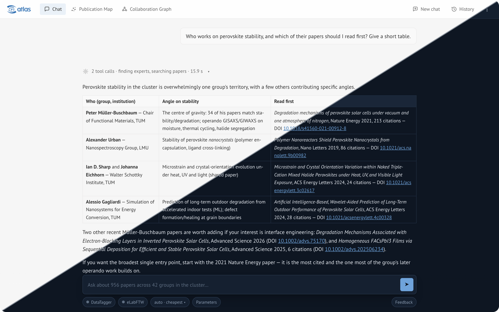
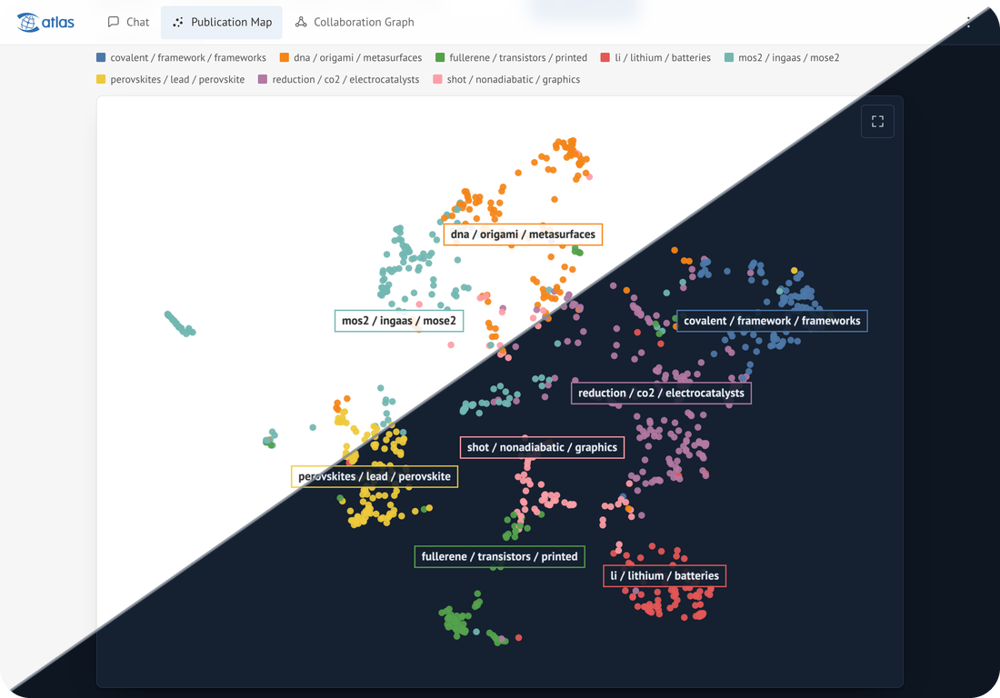
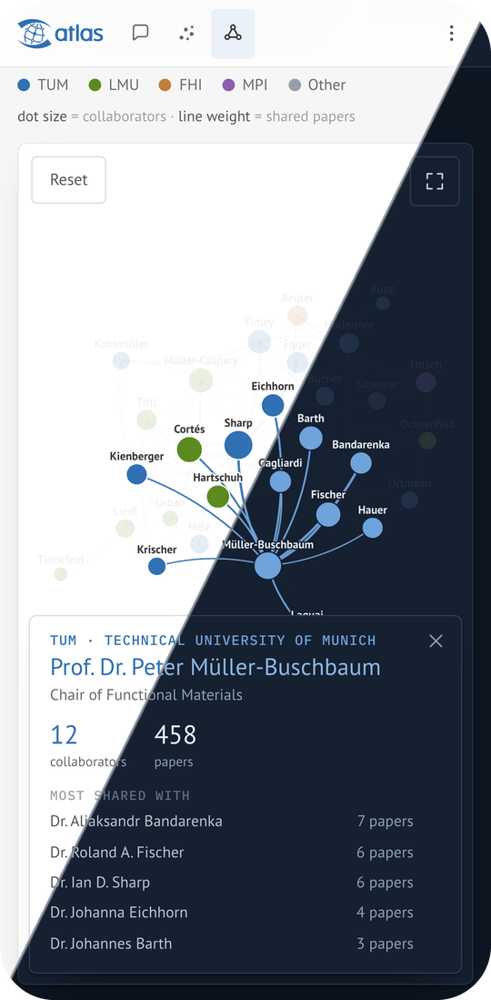

# Cluster Research Assistant

LLM research assistant over a research cluster's publications, principal
investigators, proposal and live data sources. One pip-installable package reads
a `.env` file, serves a web assistant and an outward MCP endpoint, and talks to
the external MCP servers a cluster has. Atlas, the e-conversion deployment,
is one configuration of it.



<p align="center">
  
  &nbsp;
  
</p>

The same interface on a desktop, a tablet and a phone, in the light theme
above the diagonal and the dark one below it. On a touch screen the maps pan
with one finger and zoom with two, a tapped paper or person keeps its details
on screen, and either map can take the whole window.

## Install

```bash
pip install .
```

Requires Python 3.11 or newer. The query encoder's weights are a Git LFS
object, so a source checkout needs `git lfs install` before cloning (or
`git lfs pull` after). Without them semantic search is off and everything else
works.

## Run

```bash
cp .env.example .env      # fill in the values
cra check-config          # validate and print the resolved settings
cra db upgrade            # create or migrate the database (CRA_HISTORY_URL)
cra library check          # verify the library bundle
cra serve
```

## The library bundle

`CRA_LIBRARY_PATH` points at the library: `papers.csv` is required, and each of
`abstracts.json`, `fulltexts.json`, `pis.json`, `embeddings.npz`, `graph.json`,
`proposal.md` and `publication_map.json` switches on the tools that need it.
`manifest.json` records a checksum per file and the expected counts; `cra serve`
refuses a bundle that does not match it.

The path may name either a plain bundle, which nothing can write to, or a
versioned root, which an admin can replace while the service runs:

```bash
cra library init-root        # versions/<timestamp>/ plus a `current` link
cra library versions
cra library activate <version>
```

With a root, the console takes an uploaded bundle, unpacks it beside the live
one, verifies it in full, and only then moves the link, in one atomic step. A
bad upload leaves the running service untouched, and the previous versions stay,
so rolling back is moving the link again.

Everything expensive is computed when the bundle is built, never while serving:

```bash
pip install "cluster-research-assist[build]"
cra library build          # projection and clusterings for the publication map
cra library manifest       # refresh checksums and counts
```

## Semantic search

The library ships the paper vectors, so ranking needs no model. Only the query
has to be encoded, by BAAI/bge-small-en-v1.5, whose weights ship with the
package: 67 MB in half precision, which holds every one of its weights exactly.
The forward pass is written in numpy, about ten milliseconds for a query,
so neither an inference runtime nor a tokenizer library is installed.
`developer/make_encoder.py` rebuilds the weights from the published model.

The model must be the one the library was built with; a mismatch is refused,
because two models' vectors are not comparable even when the widths agree.
`CRA_QUERY_ENCODER=false` turns semantic search off and saves the encoder's
memory; keyword search, the publication map and everything else keep working.

## Placing a DOI on the map

The publication map also takes a DOI the library does not hold: the metadata is
fetched from Crossref, and from OpenAlex for the abstract Crossref often lacks,
and the paper is placed among the library's nearest work. This needs the query
encoder above; without it the map still pans, zooms and searches.

Both APIs are public and neither owes us an answer, so results and failures are
cached, and a source that starts throttling us is left alone for as long as it
asked rather than retried. Set `CRA_DOI_LOOKUP_CONTACT` to a group address --
it is sent with every request and reaches the pool these services throttle
least. `CRA_OPENALEX_BASE_URL` empty drops the abstract fallback, at the cost
of placing more papers by their title alone.

## Who may do what

Signing in is the rule. The landing page and the sign-in flow answer without an
account; everything else needs one, and a test enumerates every route so a new
one is closed until someone opens it deliberately.

| | signed in | admin |
|---|---|---|
| paper metadata, abstracts, PI profiles, the graph, the publication map | yes | yes |
| chat, within a daily cap | yes | yes |
| full texts and the proposal | yes | yes |
| saved history | yes | yes |
| accounts, allow-list, settings | no | yes |

The outward MCP endpoint is gated separately by a token that a signed-in user
mints, and serves the public tier only: metadata, abstracts, profiles and the
graph. Nothing that reads inside the full texts or the proposal is reachable
through it, passage search included: passages around a chosen query would
reconstruct a paper one query at a time.

There are two ways to sign in. **Password accounts** are always on: nobody
signs up, and there is no built-in admin. The first admin is created on the
command line with a username of your choosing (`admin`, `root` and other
guessable names are refused); admins create further accounts in the console.
A new account, and one whose password an admin reset, gets a one-time link
valid for 72 hours to set its password, so no admin ever knows it. Passwords
are argon2id hashes, links are stored as sha256, and sign-in attempts are
rate-limited per address and per username.

```bash
cra users create jdoe --name "Jane Doe" --admin     # asks for the password
cra users create bob --name "Bob Builder"            # prints a one-time link
cra users password-link bob                          # a forgotten password
```

**Institutional sign-in** through an OpenID Connect issuer such as the DFN-AAI
proxy is on when `CRA_OIDC_ISSUER`, `CRA_OIDC_CLIENT_ID`,
`CRA_OIDC_CLIENT_SECRET` and `CRA_OIDC_REDIRECT_URI` are all set, and off when
none are. Pre-registered addresses sign straight in. Anyone else whose
institution vouches for them may ask for an account: the request carries the
name, address and institution the identity provider asserted, plus the group
and the institutional page the person gives, and waits in the console for an
admin to approve it. `CRA_AUTH_ADMINS` lists the addresses that become admin
the first time they bind an identity; the claim is not consulted again
afterwards, so the role is changed in the console, not by editing the list.

An email claim is asserted by the user's home identity provider and verified
by nobody else, so an invitation also says where it may be claimed from:
`CRA_AUTH_HOME_ORGANIZATIONS` names the `schacHomeOrganization` values (for
example `tum.de,lmu.de`) accepted by default, and `--org` on an invitation
overrides that for one address. Leave both empty only if any institution in
the federation should be able to claim any invited address.

The console lists everyone who can sign in on one page: accounts, addresses
invited but not yet used, and the addresses named in `CRA_AUTH_ADMINS`. An
invitation carries the role its account will start with. The same from the
command line:

```bash
cra users add-email someone@university.de --org university.de
cra users list
cra users promote <user-id>
cra users deactivate <user-id>
```

Sessions end after `CRA_SESSION_MAX_AGE_HOURS` unused and in any case after
`CRA_SESSION_ABSOLUTE_HOURS`. Every response carries a Content-Security-Policy
that allows scripts only from the package and the pinned CDN builds, and no
images from anywhere else; state-changing requests are refused when they look
like a cross-site form. Tools a connected eLN offers are listed to the model
only when they are read-only, unless `CRA_REMOTE_WRITE_TOOLS=true`.

## The outward MCP endpoint

Other assistants can use the same tools. With `CRA_MCP_SERVER_ENABLED=true` the
service also answers streamable HTTP MCP at `CRA_MCP_SERVER_PATH` (`/mcp`),
backed by the very same registry, asked at the public tier: an internal tool is
neither listed nor reachable by name, and full texts and the proposal never
leave through it.

**Settings → Connect apps** tells people how to connect Claude, ChatGPT,
Claude Code, Codex, Cursor and VS Code, with every value to fill in.

### Signing in (OAuth)

Claude's and ChatGPT's connectors cannot send a fixed token; they sign their
person in. With `CRA_PUBLIC_URL` set (the origin people reach the deployment
at, e.g. `https://atlas.example.org`) the endpoint is also an OAuth 2.1
authorization server for itself: it serves the protected-resource and
authorization-server metadata under `/.well-known/`, points to them from every
401, and offers `/oauth/authorize`, `/oauth/token`, `/oauth/register` (dynamic
client registration) and `/oauth/revoke`. Clients may also name themselves by
a client ID metadata document, as Claude and ChatGPT do by default. The
protocol handling is the MCP SDK's; the person approves on a consent page
here, after signing in as usual.

Both a client's return address and the host of its metadata document MUST be
on `CRA_MCP_OAUTH_CLIENT_HOSTS` (default `claude.ai`, `claude.com`,
`chatgpt.com`, `vscode.dev`); loopback addresses and app schemes such as
`cursor://` may always receive people back. A sign-in becomes a row in the
person's token list ("signed in"), revocable like any token. Its access value
lives an hour and renews with a rotating refresh value; the grant ends 90 days
after its last renewal. Without `CRA_PUBLIC_URL` none of this is served and
tokens are the only way in.

### Tokens

Signed-in users mint their own tokens under **Settings → Connect apps**: a label,
an expiry of 30, 90 or 365 days, and the value, shown once. Only its sha256 is
stored. A token can be revoked there at any time, by an admin in the console's
Tokens tab, or from the command line:

```bash
cra token issue <user-id-or-email> --label "lab laptop" --days 90
cra token list [<user-id-or-email>]   # everyone's without an argument
cra token revoke <token-id>
```

Deactivating an account revokes its tokens; deleting it removes them. With
`CRA_MCP_SERVER_REQUIRE_TOKEN=false` the endpoint is open, which is a choice for
a network that is already closed. Either way every call is rate-limited
(`CRA_MCP_SERVER_RATE_LIMIT` a minute, per token, or per address without one)
and written to the audit log as one line naming the token id, the tool and how
long it took -- never the arguments, which are someone else's query.

Point a client at `https://<host><base path>/mcp` with
`Authorization: Bearer <token>`.

## Connecting your own eLabFTW, DataTagger or NOMAD

The assistant can also work with the user's *own* data, through the MCP servers
that already sit in front of eLabFTW, DataTagger and NOMAD. A user registers
once from the chat: the dialog asks for the address of their instance and their
API key, the key is passed to the registration service, and the personal token
it mints is what the assistant uses. The key is never stored and the token lives
in the process, tied to that browser session -- signing out or a restart ends
it, and neither ever reaches the database.

A source may also carry a key the deployment holds itself
(`CRA_MCP_NOMAD_TOKEN`), handed out only to the accounts
`CRA_MCP_NOMAD_TOKEN_FOR` names (a user id or a local username): those are
connected with it on their first request, so the source works without anyone
registering. Everybody else registers their own key. The shared key is
read-only by construction -- the host withholds every tool that is not declared
read-only — and it never reaches the browser.

Whatever that token unlocks upstream is exactly what the model is offered:
the tools are namespaced (`elab_*`, `dt_*`, `nomad_*`) so they cannot collide
with the library's own, and the session is pooled, so a whole conversation costs
one handshake instead of one per tool call. A source that stops answering is
replaced by a single entry saying so rather than taking the chat down.

Each is opt-in per deployment: without `CRA_MCP_ELAB_URL`,
`CRA_MCP_DATATAGGER_URL` or `CRA_MCP_NOMAD_URL` the connector interface does not
appear for it at all.

## Configuration and settings

Endpoints, keys and paths are configuration: they live in `.env`, and changing
one needs a restart. How the service behaves from day to day is policy, and
admins change it in the console or on the command line without a restart:

```bash
cra policy list                          # every setting and where its value comes from
cra policy set user_chat_daily_limit 50
cra policy set notice "Pilot running until Friday"
cra policy set notice --reset            # back to the configured default
```

## Branding

A deployment changes how the interface looks, and the few things it says that
are particular to one cluster, without touching the package. It points
`CRA_BRAND_DIR` at a directory holding any of these files. Each one missing
from it comes from the package's own brand in `src/cra/app/web/brand/`:

| File | What it is |
|---|---|
| `logo-square-light.svg`, `logo-square-dark.svg` | The mark, on the sign-in card, the empty chat and beside the name in the header. A missing dark one falls back to the brand's light one. |
| `logo-wide-light.svg`, `logo-wide-dark.svg` | A logo that includes the name. When present it replaces mark and name in the header. |
| `favicon.svg` | The tab icon. Defaults to the square light logo. |
| `theme.css` | Overrides of the design tokens, loaded after the package's stylesheets. It MAY `@import` fonts from Google Fonts, the only font source the Content-Security-Policy admits. |
| `brand.json` | `examples`: the questions offered on an empty chat. `institutions`: `{key, label, name}` for each institution the collaboration graph tells apart, `key` matching the institution recorded for a PI. `pipeline`: `{intro, stages, nodes, edges}` for the pipeline map under "Stats for nerds", which is hidden without one. |

The tokens are the custom properties in `src/cra/app/web/static/css/tokens.css`:
colours (`--ground`, `--panel`, `--ink`, `--accent`, `--accent-2`,
`--heading-ink`, `--viz-1`…`--viz-8` and the rest), fonts (`--display`, `--body`,
`--mono`), `--heading-weight` and `--radius-scale`. They are the stable
interface. The selectors in `app.css` are not, and a theme SHOULD NOT style
them. Light values go under `:root`, dark ones under `:root[data-theme="dark"]`.
The page always sets `data-theme` to the theme in effect, including when it
follows the system.

The brand is read at startup: an invalid `brand.json` stops the server with
the reason.

## Develop

Everything runs through tox:

```bash
tox -e lint        # ruff, mypy, eslint, prettier, stylelint, djlint, yamllint, actionlint, shellcheck, hadolint
tox -e tests       # fast suite: no LLM, no PostgreSQL, no downloads
tox -e build       # sdist and wheel integrity
tox -e format      # ruff, prettier and the eslint/stylelint autofixes
```

The JS and CSS tools run on a Node that tox installs into its own env (version
in `.node-version`), so nothing beyond Python is needed.

Two further suites need external resources and are not part of the default
run: `tox -e tests-postgres` (a PostgreSQL server at `CRA_TEST_POSTGRES_URL`)
and `tox -e tests-llm` (a real model endpoint through `CRA_LLM_API_KEY`,
`CRA_LLM_BASE_URL` and `CRA_LLM_MODEL`).

In CI the LLM suite is the `tests-llm` job, which starts on every pull request
and waits: it is bound to the GitHub Environment `llm`, whose required
reviewers approve it as the last action of a review, and only then does it
receive the secret `OPENROUTER_API_KEY` and run. Approving hands the key to
the code of the pull request, so read the diff first. Pull requests from forks
and from Dependabot get no secrets and skip the job; dispatch the workflow on
their branch instead. Endpoint and model default to OpenRouter in the workflow
and can be overridden by the variables `CRA_LLM_BASE_URL` and `CRA_LLM_MODEL`
of the environment.

Tests mirror the package: the tests of `src/cra/app/web/factory.py` are
`tests/app/web/test_factory.py`. Shared fixtures are in `tests/conftest.py`,
stand-ins for models and services in `tests/fakes.py`.

Conventions: conventional commits, no `os.environ` reads outside
`cra.config.settings`, no module-level per-user state, no two files with the
same basename, logging never `print`. Dependencies stay few: where a package
would serve only one function, that function is written here instead, as the
model client, BM25 and the query encoder are. `tests/test_layout.py` enforces
the layout rules, the test tree and the import layering: `cra.core` (library,
retrieval, connectors, tools) never imports `cra.assistant` (llm, chat,
mcpclient) or `cra.app` (web, auth, history, mcpserver, viz), and
`cra.assistant` never imports `cra.app`.

## License

Apache 2.0, see LICENSE.
